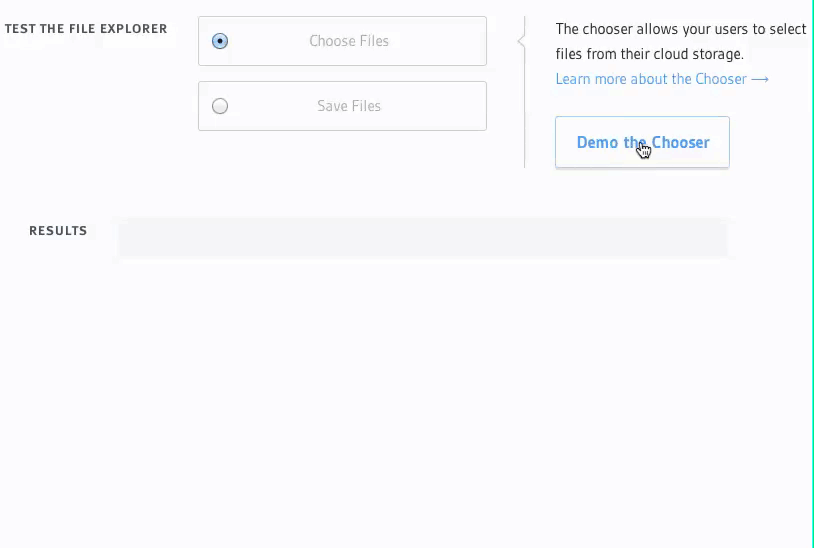

# Kloudless File Picker

**Sign up for a free account at [https://kloudless.com](https://kloudless.com) to obtain
a Kloudless App ID to initialize the File Picker with.** The File Picker is built on
our unified Storage API abstraction layer
([Cloud Storage REST API docs here](https://developers.kloudless.com/docs/latest/storage)).

The [Kloudless](https://kloudless.com) File Picker is a JavaScript library
that allows your users to browse and select files and folders from the following
storage services:

<table>
  <thead>
    <tr><th colspan="4">Services</th></tr>
  </thead>
  <tbody>
    <tr><td>Adobe CQ5</td><td>Alfresco Cloud</td><td>Alfresco</td><td>Amazon S3</td></tr>
    <tr><td>Azure Storage</td><td>Box</td><td>CMIS</td><td>Citrix Sharefile</td></tr>
    <tr><td>Dropbox</td><td>Egnyte</td><td>Evernote</td><td>FTP</td></tr>
    <tr><td>Google Drive</td><td>HubSpot Files</td><td>Jive</td><td>OneDrive for Business</td></tr>
    <tr><td>OneDrive</td><td>SMB</td><td>Salesforce Files</td><td>SharePoint Online</td></tr>
    <tr><td>SugarSync</td><td>WebDAV</td><td></td><td></td></tr>
  </tbody>
</table>

### [Click here to visit our File Picker demo!](https://output.jsbin.com/tuwodin/27)

<p align="center">
  
</p>

## Table of Contents

* [Usage](#usage)
  * [Initializing a File Picker](#initializing-a-file-picker)
    * [Import from a script tag](#import-from-a-script-tag)
    * [Import from an ES6 module](#import-from-an-es6-module)
    * [Launching the File Picker](#launching-the-file-picker)
  * [File Picker Modes](#file-picker-modes)
    * [Chooser](#chooser)
      * [Dropzone](#dropzone)
    * [Saver](#saver)
  * [Configuration](#configuration)
    * [Script tag](#script-tag)
    * [Chooser and Saver](#chooser-and-saver)
    * [Chooser Options](#chooser-options)
    * [Saver Options](#saver-options)
  * [Events](#events)
  * [Methods](#methods)
  * [Script tag example](#script-tag-example)
  * [Dropzone](#dropzone-1)
    * [Configuration](#configuration-1)
    * [Methods](#methods-1)
    * [Example](#example)
* [File Picker with Vue](#file-picker-with-vue)
* [File Picker with React](#file-picker-with-react)
* [Browser Support](#browser-support)
  * [Work with mobile devices](#work-with-mobile-devices)
* [Migration Guide](#migration-guide)
  * [From v1 to v2](#from-v1-to-v2)
    * [New Layout and New Options to Customize the UI](#new-layout-and-new-options-to-customize-the-ui)
    * [File Explorer Renamed to File Picker](#file-explorer-renamed-to-file-picker)
    * [React and Vue Wrapper Options Configuration](#react-and-vue-wrapper-options-configuration)
    * [Incompatible Configuration Options](#incompatible-configuration-options)
  * [From v1.0.0 to v1.0.1](#from-v100-to-v101)
* [Contributing](#contributing)
  * [Requirements](#requirements)
  * [Development](#development)
    * [TypeScript Definition](#typescript-definition)
  * [Build](#build)
    * [Build Options](#build-options)
  * [Testing](#testing)
    * [Test in Legacy Microsoft Edge or Internet Explorer 11](#test-in-legacy-microsoft-edge-or-internet-explorer-11)
* [Self-hosting](#self-hosting)
  * [Hosting the File Picker Page](#hosting-the-file-picker-page)
  * [Extending the File Picker Template](#extending-the-file-picker-template)
* [Misc. Development Notes](#misc-development-notes)
* [Security Vulnerabilities](#security-vulnerabilities)
* [Support](#support)
* [Changelog](CHANGELOG.md)

## Usage

### Initializing a File Picker

The File Picker JavaScript library can be imported into web applications
and launched when a user clicks an element.

#### Import from a script tag

Include the Kloudless File Picker JavaScript library on your HTML page using
a script tag that points to our CDN:

```html
<script type="text/javascript"
 src="https://static-cdn.kloudless.com/p/platform/sdk/kloudless.picker.js"></script>
```

This exposes a global `Kloudless.filePicker` object you can use to initialize
a File Picker. Check out the Configuration Options section further below for
a full list of configuration options.

```html
<script type="text/javascript">
  var picker = window.Kloudless.filePicker.picker({
    // File Picker initialization options here.
    app_id: "Your App ID", // Get your own at https://kloudless.com
  });
</script>
```

#### Import from an ES6 module

You can also install the File Picker package from NPM:

```
npm install @kloudless/file-picker
```

```javascript
import filePicker from '@kloudless/file-picker';

const picker = filePicker.picker({
  app_id: "YOUR_APP_ID"
});
```

#### Launching the File Picker

Here is a basic example of a button that launches the File Picker
given the JavaScript above that creates a `picker` object.

```html
<body>
  <button id="choose-files">Choose Files</button>

  <script src="https://static-cdn.kloudless.com/p/platform/sdk/kloudless.picker.js"></script>
  <script>
    var picker = window.Kloudless.filePicker.picker({ app_id: "APP_ID" });
    picker.choosify(document.getElementById('choose-files'));
  </script>
</body>
```

The HTML above adds a specific `id` to an element so that we
can reference it later in our JavaScript that launches the File Picker
when the element is clicked. A more complete example is present
[below](#script-tag-example) after the full list of configuration options
as well as on our [demo page](https://output.jsbin.com/tuwodin/27).

Be sure to serve the page via a web server, as pages opened via the
file URI scheme (`file://`) cannot receive postMessage messages
from the `iframe` created to display the File Picker due to security
concerns.

### File Picker Modes

The File Picker can be configured to either be a file [chooser](#chooser) to
select files and folders from cloud storage or the local computer, or a file
[saver](#saver) to export a specific file  to cloud storage.

#### Chooser

The Chooser allows your application to prompt a user to select files or a folder,
and retrieves metadata about the files or folder selected.
It supports choosing files from the local machine as well as cloud storage.
Your application can also upload files to users' cloud storage using the
[Upload API endpoint](https://developers.kloudless.com/docs/v1/storage#files-upload-a-file)
after prompting users to select a folder to upload data to.

The Chooser is therefore a popular option for both importing files to your
application as well as exporting them to specific destinations in cloud storage.

###### Dropzone

The Dropzone is a variety of the Chooser that opens when files are dragged and
dropped into it rather than only when clicked. See the [Dropzone](#dropzone-1)
section for more information.

#### Saver

The Saver allows your application to prompt a user to select a folder to save
a specific file to. This lets your application save some work over the Chooser
by automatically handling the upload to cloud storage given a link to the file.
However, only a single file is supported at a time.

The Saver returns metadata on the newly uploaded file to the application.

### Configuration

The File Picker has several configuration options. Below, we've included
options that can be set on the library inclusion tag itself, options that apply
to both the Chooser and Saver modes, and options that are specific to a
particular mode.

#### Script tag

The following attributes can be set on the `<script>` tag used to include the
File Picker JavaScript on the page.

* `data-kloudless-object` : string

  _Optional_. By default, the `filePicker` object will be exposed to 
  `window.Kloudless.filePicker`.

  Specifies a different name for the `filePicker` object bound to `window`.
  e.g. `data-kloudless-object="filePicker2"` would make the filePicker
  object accessible via `window.filePicker2`. Do not use the `async` attribute
  on the script tag if this is used.

#### Chooser and Saver

* `app_id` : string

  Chooser: _Required_

  Saver: _Required_

  The application ID is specific to the developer's application and is located
  in the developer portal on the App Details page.

* `element` : string or HTMLElement

  Chooser: _Optional (default: null)_

  Saver: _Optional (default: null)_

  Specify a CSS selector string or DOM element to attach the File Picker to
  instead of displaying the File Picker as a modal (the default). 
  If a string is provided, it will be used to retrieve the DOM element by using
  [document.querySelector](https://developer.mozilla.org/en-US/docs/Web/API/Document/querySelector).

* `retrieve_token` : boolean

  Chooser: _Optional (default: false)_

  Saver: _Optional (default: false)_

  This option will include [Bearer Tokens](https://developers.kloudless.com/docs/latest/authentication)
  in addition to the other response data, to allow you to make further requests to the API
  or save the OAuth Tokens for future use.

  ```javascript
  // Example response with an OAuth Token in the metadata.
  [{
    bearer_token: {
      key: "the_token",
    },
    ...
  }]
  ```

  Only File Pickers launched from Trusted Domains can make use of this option.
  You can add a Trusted Domain on the App Details page.

  In addition, care should
  be taken to ensure no malicious JavaScript or XSS vulnerabilities are present
  on the page, as the Bearer Token provides complete access to that user's account.

* `persist` : string

  Chooser: "none", "local", "session" (default: "local")

  Saver: "none", "local", "session" (default: "local")

  This option specifies how to persist connected account information, such as
  Bearer tokens to access the Kloudless API.

  * `local`: [localStorage](https://developer.mozilla.org/en-US/docs/Web/API/Window/localStorage)
  * `session`: [sessionStorage](https://developer.mozilla.org/en-US/docs/Web/API/Window/sessionStorage)
  * `none`: No storage. Data only persists in memory, within each File
    Picker instance.

  The File Picker will fall back to `local` if an invalid option is specified,
  and fall back to `none` if either `localStorage` or `sessionStorage` are not
  accessible.

* `services` : array

  Chooser: _Optional (default: ['file_store'])_

  Saver: _Optional (default: ['file_store'])_

  This option specifies which services to allow a user to explore. You can enumerate
  the specific [services](https://developers.kloudless.com/docs/latest/core#introduction-supported-services) or
  use a service group listed below as a shortcut.
  The default is the `file_store` service group.  If you specify an empty array,
  no services will show up.
  
  Service groups:
  
  * `file_store`: All File Storage services.
  * `object_store`: All Object Storage services.
  * `construction`: All Construction services.
  * `all`: All storage services.

* `account_management` : boolean

  Chooser: _Optional (default: true)_

  Saver: _Optional (default: true)_

  If `false`, hides the Account menu entry in the dropdown. This can be
  combined with the `tokens` option to ensure a user only browses a pre-defined
  list of accounts and also does not disconnect any of the accounts. If account
  disconnection is permitted, set `services` to `[]` rather than disabling the
  `account_management` option.

* `display_backdrop` : boolean

  Chooser: _Optional (default: false)_

  Saver: _Optional (default: false)_

  If `true`, displays a shadow backdrop behind the File Picker, and prevents the
  page body from scrolling.


* `locale` : string

  Chooser: _Optional (default: "en")_

  Saver: _Optional (default: "en")_

  The Kloudless File Picker supports i18n/l10n. You can specify any of the
  following [ISO-639-1 codes](https://en.wikipedia.org/wiki/List_of_ISO_639-1_codes):

  `ar`, `az`, `bs`, `cs`, `cy`, `da`, `de`, `el`, `en`, `es`, `et`, `fa`,
  `fi`, `fr`, `he`, `hr`, `hu`, `hy`, `id`, `it`, `ja`, `ka`, `kk`, `km`,
  `ko`, `lt`, `lv`, `mn`, `ms`, `nl`, `pl`, `pt`, `ro`, `ru`, `sk`, `sq`,
  `sr`, `sr`, `sv`, `th`, `tr`, `uk`, `zh-CN`, `zh-TW`
  
  The locale is used to identify the 
  data to retrieve from either
  the data provided in the `translations` option below or from the out-of-the-box
  translation data in the [messages directory](src/picker/localization/messages).
  If no translation data is found, the File Picker uses the `en` locale.

* `translations` : string or object

  Chooser: _Optional (default: "")_

  Saver: _Optional (default: "")_
  
  This option specifies either an object with translation data or a URL
  that returns the translation data as a JSON string. The `locale` option
  indicates which locale's translation data to use. Any translation data
  provided here overrides Kloudless' default translation data included in the
  [messages directory](src/picker/localization/messages).
  See [translations-suite-sample.json](dev-server/static/translations-suite-sample.json)
  for an example of the translation file format.
  Any strings not translated will default to the `en` locale's representation.

* `dateTimeFormat` : string

  Chooser: _Optional (default: "MMMdHm")_

  Saver: _Optional (default: "MMMdHm")_

  This option specifies a date-time format for the `locale` above.
  Please refer to the `skeleton` values in the
  [globalize JS module](https://github.com/globalizejs/globalize/blob/master/doc/api/date/date-formatter.md#using-open-ended-skeletons)
  for the formats supported.

* `create_folder` : boolean

  Chooser: _Optional (default: true)_

  Saver: _Optional (default: true)_

  If `true`, the user will be able to create folders in their cloud storage
  accounts.

* `account_key` : boolean

  This option is deprecated as OAuth 2.0 Tokens are used to authenticated accounts
  now instead of Account Keys. Please use the `retrieve_token` option below instead.
  Existing Account Keys can be converted to OAuth Tokens using
  [this endpoint](https://developers.kloudless.com/docs/v0/storage#account-keys-account-key-oauth-token).

* `keys` : array

  This option is deprecated as OAuth 2.0 Tokens are used to authenticated accounts
  now instead of Account Keys. Please use the `tokens` option below instead.
  Existing Account Keys can be converted to OAuth Tokens using
  [this endpoint](https://developers.kloudless.com/docs/v0/storage#account-keys-account-key-oauth-token).

* `tokens` : array

  Chooser: _Optional (default: [])_

  Saver: _Optional (default: [])_

  This option should list [OAuth 2.0 Tokens](https://developers.kloudless.com/docs/latest/authentication)
  for accounts the File Picker should be initialized with. The File Picker will
  make API requests for additional information on the accounts and display them
  in the list of accounts the user has connected.

  ```javascript
  {
    tokens: ["abcdefghijklmn", "opqrstuvwxyz"],
    ... // other options
  }
  ```
  
* `enable_logout` : boolean (default: true)

  If `true`, allows users to log out of their accounts, which deletes the account
  from Kloudless servers. API requests will no longer be possible to the account.

* `delete_accounts_on_logout` : boolean (default: false)
    
  If `false`, the File Picker only removes tokens from the storage configured
  in `persist` option when users log out. If `true`, it also deletes the accounts 
  from the Kloudless server and invalidates the OAuth tokens.

* `oauth` : function (default: _see below_)

  Use this parameter to customize the query parameters used in the first leg of
  the Kloudless OAuth flow when authenticating users.
  A full list of parameters supported is available on the
  [OAuth docs](https://developers.kloudless.com/docs/latest/authentication#oauth-2.0-first-leg).

  By default, the `scope` the File Picker uses is
  `"<service_id>:normal.storage <service_id>:normal.basic"`. Note that the
  following options cannot be overridden for consistency or security reasons:

  * `client_id`,
  * `response_type`
  * `redirect_uri`
  * `origin`
  * `state`

  Set the value of the `oauth` option to a function that accepts a string.
  The function will be called when a user attempts to connect an account, with
  the string argument being the
  [identifier](https://developers.kloudless.com/docs/latest/core#introduction-supported-services)
  of the service the user is attempting to connect. For example, `gdrive`.

  The function should return an object representing the attributes to
  include as query parameters in the OAuth flow. Don't URL-encode the values;
  the File Picker handles that. Here is an example that customizes the
  OAuth permissions requested if a user attempts to connect a Google Drive
  account, and also pre-fills the server URL if a user chooses to connect an FTP
  account:

  ```javascript
  {
    oauth: (service) => {
      const authOptions = {};

      switch (service) {
        case 'gdrive':
          // Ask for read-only access to Google Drive data instead.
          authOptions.scope = 'gdrive.storage."https://www.googleapis.com/auth/userinfo.email https://www.googleapis.com/auth/drive.readonly":raw';
          // Pass additional query parameters to Google Drive.
          authOptions.raw = {
            'query_name': 'query_value'
          };
          break;
        case 'ftp':
          // Set a default domain when connecting an FTP account.
          authOptions.form_data = {
            domain: 'ftps://ftp.example.com:21',
          };
          break;
      }

      return authOptions;
    },
    ... // other options
  }
  ```  

  If you're familiar with the configuration options accepted by the
  [Kloudless Authenticator](https://github.com/Kloudless/authenticator#options),
  the File Picker requires options returned in the same format that the
  Authenticator accepts. For convenience, the following 
  [supported parameters](https://developers.kloudless.com/docs/latest/authentication#oauth-2.0-first-leg)
  can be specified as objects as shown in the example above:

  * `form_data` (converted to a URL-encoded JSON string)
  * `custom_properties` (converted to a URL-encoded JSON string)
  * `raw` (converted to the `raw[key]=value` format described in the docs)

* `custom_style_vars` : object

  This project uses LESS as a CSS pre-processor. Since LESS can be run in the
  browser, we support overriding CSS global variables dynamically to customize
  styling. For example, change the primary color by setting `main_color`:

  ```js
  {
    custom_style_vars: {
      main_color: "black"
    }
  }
  ```

  Please refer to [variables.less](./src/picker/css/variables.less) for the
  full list of available variables. Most are related to aspects such as colors,
  fonts, or dimensions. Specifying the `@` prefix for each variable is optional.

  For further customization, we recommend forking this project and hosting
  the resources on your own, since we don't guarantee backward-compatibility 
  when overriding undocumented variables.

* `root_folder_id`: object

  Chooser: _Optional (default: {})_

  Saver: _Optional (default: {})_

  This option is used to specify a specific folder as the root folder
  for any existing account browsable via the File Picker. This is helpful for
  scenarios where the user may not have access to the root or other high-level
  folders but does have access to specific known folders within the account.
  This option accepts a map of the Kloudless Account ID to the Kloudless Folder
  ID in the format `{[account_id]: "root_folder_id"}`, as shown below:

  ```js
  {
    1234: "folder_abc1234",
    5678: "folder_somefolder5678"
  }
  ```

  The example above sets the root folder to `folder_abc1234` for account
  `1234` and `folder_somefolder5678` for the account `5678`.

  When connecting or switching to an account that has a root folder ID
  configured, the default folder opened will be the specified folder rather 
  than the usual root folder `root`. The File Picker UI won't enable navigation
  outside of the chosen root folder, although it may be accessible to the user
  via direct API requests. This configuration option should therefore not be
  used to limit access for security purposes.

  For existing accounts, be sure to also use the `tokens` attribute to specify
  the Bearer tokens to use to browse the account. If `account_management` is
  enabled (the default), the user may also connect new accounts. Since the
  root folder ID is not possible to provide in advance until the newly
  connected account's ID is known, please first listen for the
  `addAccount` [event](#events), then perform API requests to determine
  the ID of the root folder to display, and finally call the `picker.update()`
  [method](#methods) with the updated configuration that includes the root
  folder ID for the newly connected account within it:

  ```javascript
  let root_folder_id = {}; // Any existing root folder IDs
  picker.on('addAccount', account => {
    // Set `retrieve_token: true` in the config to retrieve the Bearer token
    // to use in API requests to determine the right root folder ID, and
    // then include that root folder ID below.
    root_folder_id[account.id] = 'root';

    picker.update({ root_folder_id });
  });
  ```
  Here is an example of limiting users connecting SharePoint accounts to only
  selecting files from within the primary document library of the main site
  collection: [https://jsfiddle.net/kloudless/uwax8tqy/](https://jsfiddle.net/kloudless/uwax8tqy/).
  
  The example above uses a known folder ID based on a consistent location within the
  SharePoint tenant, but most folders' IDs are random and must be obtained dynamically.
  To obtain the Kloudless Folder ID for an upstream folder path, please
  use the
  [Encode Raw Data API endpoint](https://developers.kloudless.com/docs/latest/core#raw-data-and-the-pass-through-api-raw-data-kloudless-id)
  or list the contents of the account, beginning at the `root`, until the required
  folder's metadata is obtained.

  Note: Search requests may still return results outside the root folder
  specified for services that do not support the `parents`
  [query parameter](https://developers.kloudless.com/docs/latest/storage#locate-files-search).

* `close_on_success` : boolean (default: true)

  Defaults to `true`, which closes the File Picker when all the selections in
  the Chooser have been processed successfully, or when all the files in the
  Computer view or the Saver have been uploaded successfully.

  If `false`, the user will see a success message rather than the File
  Picker closing.

  For the Chooser and the Saver, if the `element` option is specified, this
  option will always be `false`. For the Dropzone, this option is always `true`.

#### Chooser Options

* `multiselect` : boolean

  Chooser: _Optional (default: false)_

  This option allows a user to select multiple files or folders from cloud
  storage or their local device. The Chooser will return a list of one or more
  entries. Selecting multiple folders is not currently supported on mobile
  devices.


* `computer` : boolean

  Chooser: _Optional (default: false)_

  Dropzone: _Always true_

  This option allows users to upload files directly from their computer.

  __Configuring the Chooser's Upload Location__

  The Chooser will upload files to the developer's Upload Location.
  The Upload Location can be set in the
  [developer portal](https://developers.kloudless.com).
  Under 'UI Tools' tab, click 'File Picker' and follow the instructions for 
  selecting a folder in a storage service such as Amazon S3. All local files
  from a user will be uploaded there.

* `link` : boolean

  Chooser: _Optional (default: false)_

  If `true`, generates a link to the selected file(s). The link will be provided
  in the `link` key of the response sent to the `success` event. For asynchronous
  requests, the result of the [Kloudless Task](https://developers.kloudless.com/docs/latest/core#asynchronous-requests-and-the-task-api)
  will contain the link instead.

  Use with the `copy_to_upload_location` option to generate a link to the newly
  copied file.

  The Kloudless File Picker will fire the `error` event if the link
  generation fails.

  ```javascript
  // Success event result when `link` is true:
  [{
    "link": "https://<the file link>",
    ...
  }]
  ```

* `link_options` : Object

  Chooser: _Optional (default: {})_

  The `link_options` object provides parameters to use when the File Picker
  creates links. See the
  [documentation for creating links](https://developers.kloudless.com/docs/latest/storage#links-create-a-link)
  for a full list of the possible options available.
  Note that links to selected files are only created if the `link`
  configuration option is set to `true`. In addition, files with the
  `downloadable` attribute set to `false` cannot be downloaded so
  they cannot be selected if `link_options.direct` is `true`.

  For example:

  ```javascript
  {
    link_options: {
      direct: true,
      expiration: "2020-10-12T00:00:00"
    },
    ... // other options
  }
  ```

* `copy_to_upload_location` : string

  Chooser: _Optional (default: null)_

  If this option is set, it will copy any file or non-root folder selected by
  the user from cloud storage to the location that files uploaded from the
  user's computer are placed in.

  Since the file must be able to be downloaded for this to occur, only files
  with the `downloadable` attribute set to `true` can be selected when this
  option is enabled. When copying folders, the non-downloadable files will
  be skipped.

  An Upload Location must be configured via the developer portal to make use of
  this option.

  This option accepts two values:
  * `'async'`: Triggers an asynchronous copy and immediately returns a Task ID
    in the `success` event callback that can be checked using the
    [Kloudless Task API](https://developers.kloudless.com/docs/latest/core#asynchronous-requests-and-the-task-api)
    for the copied file or folder's metadata.

    The Kloudless Task API returns a Task object that includes progress
    information until the task finishes.  
    When the task finishes, the API endpoint returns
    [File](https://developers.kloudless.com/docs/latest/storage#files)
    or [Folder](https://developers.kloudless.com/docs/latest/storage#folders)
    object instead.  
    If the task fails, the endpoints returns an
    [Error](https://developers.kloudless.com/docs/latest/core#error-handling-error-message-format).

    Here is an example of polling for the result of a task using jQuery:
    ```javascript
      function pollingTask(taskId, accountToken, delay) {
        return new Promise((resolve, reject) => {
          setTimeout(() => {
            $.ajax({
              url: `https://api.kloudless.com/v1/accounts/me/tasks/${taskId}`,
              headers: { Authorization: `Bearer ${accountToken}` },
            }).done(resolve).fail(reject);
          }, 5000);  // Poll every 5 seconds
        });
      }

      picker.on('success', async (results) => {
        // Assume the user only selects one item.
        const [
          {
            id: taskId,
            // Should enable `retrieve_token` option to get bearer_token.
            bearer_token: { key: accountToken },
          },
        ] = results;
        try {
          let response = await pollingTask(taskId, accountToken);
          while (response.id === taskId) {
            // Task has not finished yet, so keep polling.
            response = await pollingTask(taskId, accountToken);
          }
          // Task has finished.
          console.log(response);
        } catch (jqXHR) {
          if (jqXHR.responseJSON) {
            // Kloudless API Server returned an error.
            console.error(response.responseJSON);
          }
        }
      });
    ```
  * `'sync'`: Triggers a synchronous API request to copy the file or folder and
    polls till the copying is complete. The `success` event callback receives
    the newly uploaded file or folder's metadata.

  The deprecated `true` option is only available for copying files and will
  return the new file's hypothetical metadata even though the copy has not yet
  completed. Please migrate to using `'sync'` instead for similar behavior with
  a guarantee that the copy is successful.

  The Kloudless File Picker will fire the `error` event if the copy
  operation is not completely successful.

* `upload_location_account` : string

  Chooser: _Optional (default: null)_

  If multiple Upload Locations are configured via the developer portal, this
  specifies the Account ID of the Upload Location to use. This option is not
  required if only one Upload Location is configured. The Account ID is a number
  that can be found in the File Picker Upload Locations section of the
  [Developer Portal](https://developers.kloudless.com/applications/*/ui-tools/file-picker) page.
  `upload_location_folder` must also be provided.

* `upload_location_folder` : string

  Chooser: _Optional (default: null)_

  If multiple Upload Locations are configured via the developer portal, this
  specifies the Folder ID of the Upload Location to use. This option is not required
  if only one Upload Location is configured. The Folder ID is an encoded string that
  can be found on the File Picker Upload Locations section of the
  [Developer Portal](https://developers.kloudless.com/applications/*/ui-tools/file-picker).
  The ID of a sub-folder may be specified if the option is enabled in the
  Developer Portal. `upload_location_account` must also be provided if more than
  one upload location exists.

* `uploads_pause_on_error` : boolean

  Chooser: _Optional (default: true)_

  If `true`, uploads using the Computer option will pause if errors are encountered,
  giving the user the option to retry the upload by clicking 'Resume'. The user could
  also remove the file that is failing to upload from the queue.
  If `false`, the file that encounters errors will be skipped and excluded from the
  list of files returned in the `success` callback.

* `types` : array

  Chooser: _Default: ['all']_

  This option specifies which types of elements the File Picker will show to the
  user. You can filter based on file extension or by the following categories:

  * `all` This configures the File Picker to show all file types and folders.
  The user can select either files or folders. Do not combine with other options.

  * `folders` This configures the File Picker to gray out files and show folders.
  The user can only select folders.

  * `files` This configures the File Picker to show all file types. The user can
  only select files.

  * `text`

  * `documents`

  * `images`

  * `videos`

  * `audio`

The categories will be translated to the corresponding file extensions and MIME
types internally. Check `TYPE_ALIAS` and `MIME_TYPE_ALIAS` in
[constants.js](src/picker/js/constants.js) for the specific file extensions
and MIME types mapped to.

You can also specify file extensions as well as MIME types by including them
in the array without the period (`.`) prefix. For example, 
`['pdf', 'jpg', 'jpeg', 'png', 'application/vnd.google-apps.document']`.

Include `''` to allow files with the MIME type `application/octet-stream` or
without a file extension to be selected.

* `max_size` : number

  Chooser: _Optional (default: 0)_

  The maximum size (in bytes) of files that can be selected, or uploaded in the
  case of local uploads via the Computer option. This limit applies per file
  selected, and not collectively.

  Set to `0` to disable this limit.

  Files with an unknown size, such as Google Docs, can still be selected
  regardless of this option.


#### Saver Options

* `files` : array

  Saver: _Optional (default: [])_

  This option should list files for the File Picker to save. The format
  should be an array of Javascript Objects containing a file url and name.
  You can specify up to 100 files. Each file will be uploaded via the Kloudless
  API's [upload endpoint](https://developers.kloudless.com/docs/latest/storage#files-upload-a-file),
  using the `url` attribute.

  ```javascript
  {
    files: [{
      url: "http://<your image url>",
      name: "filename.extension"
    }, {
      url: "http://<your image url>",
      name: "filename.extension"
    }],
    ... // other options
  }
  ```

### Events

* `success(results)`

  Fired when the user's selections in the Chooser are processed successfully, or
  files are uploaded successfully via the Chooser's Computer option or Saver.  
  The `success` event is still fired even if only part of the items were
  successfully chosen or saved.

  `results` is an array of [File](https://developers.kloudless.com/docs/latest/storage#files)
  or [Folder](https://developers.kloudless.com/docs/latest/storage#folders)
  objects that were successfully selected.

  When `copy_to_upload_location` is set to `async`, `results` will instead be
  an array of Task objects returned by the
  [Kloudless Task API](https://developers.kloudless.com/docs/latest/core#asynchronous-requests-and-the-task-api).

  The File Picker closes once this event has triggered.

* `cancel()`

  Fired if the user decides to cancel an operation. The File Picker will
  be closed on cancellation.

* `error(results)`

  Fired when any of the selections fail to process or any of the
  files being uploaded fail to upload successfully.  
  The `error` event is still fired even if only part of the items failed to
  be chosen or saved.

  `results` is an array of failed objects. The object structure varies based
  on usage. For the selections in the Chooser, the object is a
  [File](https://developers.kloudless.com/docs/latest/storage#files)
  or [Folder](https://developers.kloudless.com/docs/latest/storage#folders)
  object.

  For uploads via the Chooser's Computer option or Saver, the object is the
  same as that for the `startFileUpload` event mentioned below.

  An additional key, `error`, is added to the object metadata and includes
  the error returned from the
  [Kloudless API](https://developers.kloudless.com/docs/latest/core#error-handling-error-message-format)
  describing why the operation failed.

  Here is an example of the `error` object:
  ```json
  {
    "status_code": 404,
    "message": "File not found: 1D-QuGwx7acbeGQ3STSCphysJsQs8YHJR",
    "error_code": "not_found",
    "id": "9b62d9d8-7bc7-495b-b97a-33b43720274d"
  }
  ```


* `open()`

  Fired when the File Picker is displayed to the user. This occurs when
  the Chooser or Saver are opened.

* `close()`

  Fired when the File Picker is hidden from the user. This occurs when
  the File Picker is closed. This could be due to either a user action,
  such as choosing files or cancelling, or due to the `close()` method
  being called (not to be confused with this `close` event handler).
  The `success` or `cancel` events will also be fired if appropriate.

* `selected(results)`

  Fired when the user selects files or folders from the
  File Picker, but before the list is sent to the Kloudless API for additional
  processing. This means this event fires before the `success` event,
  and allows you to perform any action while waiting to get the final list.

  If `copy_to_upload_location` and `link` are both disabled, then this event is
  equivalent to the `success` event (since nothing needs to happen on the
  server after the selections are made), so this event serves no purpose then.

  `results` is an array of [File](https://developers.kloudless.com/docs/latest/storage#files)
  or [Folder](https://developers.kloudless.com/docs/latest/storage#folders)
  objects.

  This event is not fired when the user uses the Chooser's Computer option or
  the Saver. See `startFileUpload` and `finishFileUpload` for events fired
  in those cases.

* `addAccount(account)`

  Fired when a user successfully connects an account.
  `account` is an object containing the account ID, name, and service ID.

  Here is an example:
  ```json
  {
    "id": 123456,
    "name": "user@domain.com",
    "service": "gdrive"
  }
  ```

* `deleteAccount(accountId)`

  Fired when a user successfully removes an account.

* `startFileUpload(file)`

  Fired when a file upload starts, or is requested to be retried by a user
  after encountering errors (see the `uploads_pause_on_error` option).
  This event is only fired when the user uploads a file via the Chooser's
  Computer option or the Saver. 

  For the Chooser's Computer option, the `file` object has the following
  attributes:
  * `id` A randomly generated ID.
  * `name` The uploaded file's name.
  * `size` The uploaded file's size.
  * `mime_type` The uploaded file's MIME type.

  Here is an example:
  ```json
  {
    "id": "o_1efeta5ej5ac1v4t139e39l1ldka",
    "mime_type": "image/jpeg",
    "name": "15224125762.jpeg",
    "size": 9834
  }
  ```

  For the Saver, the `file` object has the following attributes instead:
  * `url` The file URL specified in the Saver's launch options.
  * `name` The file name specified in the Saver's launch options.

  Here is an example:
  ```json
  {
    "url": "https://s3-us-west-2.amazonaws.com/static-assets.kloudless.com/static/kloudless-logo-white.png",
    "name": "kloudless-logo.png"
  }
  ```

  This event is fired once per file and not per uploaded chunk.

* `finishFileUpload(file)`

  Fired when a file upload completes successfully (once per file being
  uploaded). The `file` object contains the same information as provided to
  the `startFileUpload` event above, with an additional key `metadata`
  whose value is the resulting [File](https://developers.kloudless.com/docs/latest/storage#files).

  This event is only fired when the user uploads a file via the
  Chooser's Computer option or the Saver.

* `logout()`

  Fired when the user clicks the logout link in the File Picker, which
  clears the local state of accounts connected to the File Picker.

* `drop()`

  Fired when drops files into Dropzone.

### Methods

* `filePicker.picker(options)`

  You can initialize a Kloudless File Picker using the options mentioned above.

* `filePicker.getGlobalOptions()`

  Get [build options](#build-options). These are options configured when
  the File Picker JavaScript library was initially built. See the
  [Self-Hosting](#self-hosting) section for more information.

* `filePicker.setGlobalOptions(buildOptions)`

  Change [build options](#build-options) during run-time. The widget is
  configured to work with default values, so these options should only be set
  when needed.

* `picker.choose()`

  This method allows you to launch a Chooser.

* `picker.choosify(element)`

  This method binds a click handler that launches the Chooser to the DOM element.

* `picker.save(files)`

  This method allows you to launch a Saver. See *Saver Options* for more information
  on the format for `files`.

* `picker.savify(element, files)`

  This method binds a click handler that launches the Saver for `files` to the
  DOM element.

* `picker.on(event, callback)`

  Invokes a callback method on a particular event. See the `Events` section above
  for a list of event names, as well as the arguments the corresponding callback
  methods will be invoked with.

* `picker.close()`

  This method closes the File Picker window.


* `picker.update(options)`

  Updates the configuration options the File Picker was initialized with. The
  File Picker will immediately begin using the new configuration.
  `options` is an Object with the new configuration. Not all options can be
  updated in this manner. The following are not supported:

  * `app_id`
  * `types`
  * `services`
  * `persist`
  * `create_folder`
  * `account_key`
  * `custom_style`
  * `custom_css` (deprecated)
  * `locale`
  * `element`
  * `max_size`
  
* `picker.logout(deleteAccount=false)`

  Removes all authentication tokens for the accounts connected to the File 
  Picker as configured via the `persist` option. If `deleteAccount` is set 
  to `true`, it also deletes the accounts from the Kloudless server and 
  invalidates the OAuth tokens, rendering them unusable and the accounts
  inaccessible.
     
  This method isn't impacted by the `delete_accounts_on_logout` option. 

### Script tag example

To start using the File Picker, simply include the JavaScript file in your
HTML file. You can then create an element on the page to launch the File Picker.

```html
<body>
  <button id="file-picker-button">Open File Picker</button>
  <script type="text/javascript" src="https://static-cdn.kloudless.com/p/platform/sdk/kloudless.picker.js"></script>
  <script type="text/javascript">
      // File Picker initialization JS here.
  </script>
</body>
```

The next step is to customize the File Picker according to the developer's needs.
In this example, we've decided to disable multiselect, return links, and allow for
a few types of files.  All of this is contained within the initialization.

```javascript
// File Picker initialization JS
var picker = window.Kloudless.filePicker.picker({
  app_id: 'YOUR_APP_ID',
  multiselect: false,
  link: true,
  types: ['images', 'documents', 'text']
});
```

The final step is to launch the File Picker and handle the events returned from
the File Picker based on a user's actions.

**[Visit our demo of the File Picker!](https://output.jsbin.com/tuwodin/27)**

```javascript
// When a user successfully selects or saves a file
picker.on('success', function(files) {
  // files is an array of JS objects that contain file metadata.
  console.log('Successfully selected files: ', files);
});

// When a user cancels the File Picker
picker.on('cancel', function() {
  console.log('File selection cancelled.');
});

// Launching the File Picker to choose when a user clicks the 'Open File Picker'
// button.
picker.choosify(document.getElementById('file-picker-button'));

// In addition, you can launch the File Picker programmatically with choose()
picker.choose();

// Launching the Picker to save when a user clicks the 'Open File Picker' button
// Note: you can pass in an array of files instead of using the configuration
// option
var files = [{
  url: 'http://<your image url>',
  name: 'filename.extension'
}, {
  url: 'http://<your image url>',
  name: 'filename.extension'
}];

picker.savify(document.getElementById('file-picker-button'), files);

// In addition, you can launch the File Picker programmatically with save()
var files = [{
  url: 'http://<your image url>',
  name: 'filename.extension'
}, {
  url: 'http://<your image url>',
  name: 'filename.extension'
}];

picker.save(files);
```

### Dropzone

The Dropzone is a variety of the Chooser that allows users to drop files into
it from their Computer rather than only click on it to launch the File Picker.
It opens in place when files are dropped into it.

#### Configuration

The configuration is similar to the Chooser's, but requires the `element` option
to indicate where to display the Dropzone, as described below. In addition, the
`computer` option is always set to `true`, and an Upload Location must be
configured as described for the Chooser.

* `element` : string or HTMLElement

  Chooser: _Required_

  The DOM element to bind the Dropzone to. If a CSS selector string is provided,
  it will be used to retrieve the DOM element by using
  [document.querySelector](https://developer.mozilla.org/en-US/docs/Web/API/Document/querySelector).
  The drop zone will render a 600px * 100px area for the user to drag and drop
  files in. The area's width will adjust automatically when the viewport
  width is lower than 600px.

#### Methods

* `filePicker.dropzone(options)`

  Initialize a Dropzone using the options mentioned above.

* `dropzone.on(event, callback)`

  See `picker.on(event, callback)` for more information.

* `dropzone.close()`

  See `picker.close()` for more information.

#### Example

[Visit our JSBin example of the Dropzone!](https://output.jsbin.com/tariday)

HTML

```html
<div id="dropzone" style="width: 600px; height: 100px;"></div>
```

JavaScript

```javascript
var dropzone = window.Kloudless.filePicker.dropzone({
  app_id: 'Your App ID',
  element: '#dropzone',
  multiselect: true, // To upload more than 1 file.

  // Chooser options below:
  computer: true,
  link: true,
  services: ['all'],
  types: ['all'],
});

// All of the Chooser's events are supported.
// For example:
dropzone.on('success', function(files) {
  console.log('Successfully selected files: ', files);
});

// See the File Picker's Example section for other events.
```

## File Picker with Vue

See [File Picker with Vue](./README.vue.md).

## File Picker with React

See [File Picker with React](./README.react.md).

## Browser Support

* Chrome 56+
* Firefox 56+
* IE 11+
* Edge 12+
* Safari 8+
* Opera 49+

### Work with mobile devices
To use the Kloudless File Picker on devices with narrow screens, please add a
[Viewport meta tag](https://developer.mozilla.org/en-US/docs/Mozilla/Mobile/Viewport_meta_tag)
to the web page launching the File Picker. This ensures the File Picker uses styling
appropriate for mobile screen sizes.

The meta tag assumes that your entire web page renders well in narrow screens 
since it applies to your page as a whole and not just the File Picker.
Please test out your page's usability if you are adding the meta tag for the
first time.

Here is an example meta tag:

    <meta name="viewport" content="width=device-width, initial-scale=1">

If your page benefits from preventing some devices such as iPhones from
zooming in on input fields, you can also add in the `user-scalable=no` option 
as shown below. Input fields such as `<input>` and `<select>` are used in the
File Picker as well.

    <meta name="viewport" content="width=device-width, initial-scale=1, user-scalable=no">


## Migration Guide

### From v1 to v2

#### New Layout and New Options to Customize the UI

v2 represents a new layout and set of options for the File Picker, including:
* A completely new theme for the UI with improved responsiveness, clearer HTML
  and CSS structure with consistent naming conventions, and several bug-fixes. 
* A documented format for customizing UI styling such as colors and fonts
  without forking the entire project.

Provided your application isn't already customizing styling by using the
`custom_css` option as detailed below, it will automatically begin using the
new version.

#### File Explorer Renamed to File Picker

The File Explorer has been renamed to the File Picker to improve clarity.
The entire JS namespace, as well as any relevant method, variable, or
configuration option names, have been transitioned from referencing an
"explorer" to a "picker", while preserving backwards-compatibility.

Here is a table to assist with transitioning previously publicly documented
names to their newer counterparts:
  
  Description | Old Name | New Name
  ---|---|---
  namespace | window.Kloudless.fileExplorer | window.Kloudless.filePicker
  method | explorer() | picker()
  global option | explorerUrl | pickerUrl
  environment variable | EXPLORER_URL | PICKER_URL
  script tag URL | https://static-cdn.kloudless.com/p/platform/sdk/kloudless.explorer.js | https://static-cdn.kloudless.com/p/platform/sdk/kloudless.picker.js

Forked projects that are migrating to v2 should take care to replace names
similarly.

#### React and Vue Wrapper Options Configuration

Previously, `getGlobalOptions` and `setGlobalOption` were imported from
`@kloudless/file-picker` as shown below:

```javascript
import filePicker from '@kloudless/file-picker';

filePicker.getGlobalOptions()
filePicker.setGlobalOptions({...})
```

Now, they can be imported from `@kloudless/file-picker/react`,
or `@kloudless/file-picker/vue`, depending on the framework in use:

```javascript
import { setGlobalOptions, getGlobalOptions } from '@kloudless/file-picker/react';
// Or use the following syntax for VueJS:
// import { setGlobalOptions, getGlobalOptions } from '@kloudless/file-picker/vue';

getGlobalOptions()
setGlobalOptions({...})
```

#### Incompatible Configuration Options

Below are some options that will no longer be effective, or will force the
previous version to continue to load instead, to maintain compatibility.

* `custom_css` : string

  Chooser: _Optional (default: null)_

  Saver: _Optional (default: null)_

  This option is deprecated and no longer supported in the latest versions
  of the File Picker. Using this option will result in the File Picker
  reverting to a previous layout that supported this option.

  Refer to the `custom_style_vars` option to customize styling instead.
  Alternatively, you may clone this project and self-host it to customize the
  UI more extensively.
  
  **Previous Notes**

  `custom_css` is an optional attribute that accepts a URL to a stylesheet for
  the File Picker to load to override or customize styling.
  Supports `(http|https)://domain.com/path/to.css`, `//domain.com/path/to.css`, 
  and `/path/to.css` formats.

  To use the `custom_css` option, the domain the File Picker is launched from
  must be added to the application's list of
  [Trusted Domains](https://developers.kloudless.com/applications/*/details#trusted-domains).

### From v1.0.0 to v1.0.1

When using the script tag, the target exposed has been updated from
`window.Kloudless` to `window.Kloudless.fileExplorer` to better scope our UI
tools. All the exports under `window.Kloudless` are deprecated and have been
moved to `window.Kloudless.fileExplorer`.

## Contributing

Contributions are welcome and appreciated. We'd love to discuss any ideas you
have to improve or extend the File Picker. We recommend
contacting us at [support@kloudless.com](mailto:support@kloudless.com)
first for major modifications that you would like merged in so we can
offer feedback on its implementation.

### Requirements

Install [Node.js](https://nodejs.org/en/download/)
(`sudo apt-get install nodejs` or equivalent)  
Make sure you have nodejs >= 10.16.0 and npm >= 6.9.0.
Then run the following commands:

    npm ci
    npm run install-deps

To develop Vue or React wrapper, you might want to install the
corresponding storybook:

    npm ci --prefix=storybook-vue    # for Vue
    npm ci --prefix=storybook-react  # for React

### Development

Use the following command to set a Kloudless App ID and run the local
development server:

```bash
KLOUDLESS_APP_ID=<your_app_id> npm run dev
```

The File Picker that launches on the test page uses the App ID to
connect accounts. It must therefore be the ID of a valid Kloudless
Application on the Kloudless API server the File Picker accesses.

By default, the development server points to `https://api.kloudless.com`.
However, you can point it to an alternate Kloudless API server using the
`BASE_URL` environment variable [build option](#build-options) as shown below.

```bash
# Export this environment variable before the `npm run dev` command above.
export BASE_URL=<your_kloudless_api_server_url>
```

The development server supports automatically rebuilding the source files
whenever changes are saved. However, hot reloading scripts is not supported
yet; you will need to reload the page to view your changes.

#### TypeScript Definition

Be sure to update **src/loader/js/interface.d.ts** if the corresponding
interface is changed.

### Build

The command below generates a minified production build at `/dist`.

```bash
npm run build
```

Here is an explanation of the `dist` folder's structure:

Folder | Purpose
---|---
`loader` | Contains the script that an application includes to load the File Picker.
`picker` | Contains the File Picker assets that the `loader` loads in an iframe. Only customize this when [self-hosting](#self-hosting) the File Picker.


#### Build Options

The options below can be set during the build process as environment variables
to customize the build, or sometimes at run-time as well.

Build-time Env Var | Run-time option | Description | Default
---|---|---|---
`BASE_URL` | `baseUrl` | URL to the Kloudless API Server | https://api.kloudless.com
`PICKER_URL` | `pickerUrl` | The URL that the loader loads the file picker iframe from. | https://static-cdn.kloudless.com/p/platform/file-picker/v2/index.html

Check out the [Self-hosting](#self-hosting) section below for an example
that changes the `PICKER_URL` in order to self-host a customized fork
of the File Picker.

In addition, here is an example that directs API requests from the File Picker
to an alternate Kloudless server:

```
BASE_URL=<your_kloudless_api_server_url> npm run build
```

### Testing

To test the build generated by `npm run build`, run the following command:

```bash
KLOUDLESS_APP_ID=<your_app_id> npm run dist-test
```

To test the TypeScript definition file, run the following command:
```bash
npm run test:ts
```

#### Test in Legacy Microsoft Edge or Internet Explorer 11

Microsoft provides
[Windows 10 virtual machines](https://developer.microsoft.com/en-us/microsoft-edge/tools/vms/)
that can be used to test the File Picker in Legacy Microsoft Edge and Internet
Explorer 11. Note that the development server won't be accessible at
`http://localhost:3000` by default because `localhost` translates to `127.0.0.1`
which points to the VM itself instead of the host running the development
server. To work around this, determine the actual IP address of the host running
the development server, such as `10.0.2.2` when using VirtualBox, and edit
`C:\windows\system32\drivers\etc\hosts` as an Administrator to add a record
that maps `localhost` to that IP.

## Self-hosting

Self-hosting the File Picker is one way to customize all aspects of the
File Picker's layout, styling, and functionality beyond what the
configuration and theming options provide.

You can fork the File Picker to make the changes you need before
[building](#build) the File Picker, which results in a JS file at
`dist/loader/loader.min.js`. This file must be included in any page you would
like to use the File Picker on. It serves as a light-weight wrapper to load
the actual File Picker page via an iframe.

Both the loader file and the rest of the File Picker's structure are discussed
in more detail in the [Build](#build) section above.

### Hosting the File Picker Page

The build contains an `picker` folder which includes the actual
HTML and functionality of the widget. By default, this is hosted by Kloudless.

If you would like to host this page yourself to customize the core File Picker
source code or styles, follow the steps below:

1. Rebuild the assets while setting `PICKER_URL` to specify the File Picker
   page URL. For example, if you'd like to host the File Picker assets at
   `https://example.com/kloudless/index.html`, run the following command:

    ```bash
    PICKER_URL=https://example.com/kloudless/index.html npm run build
    ```

    Optionally, you can also set `Kloudless.filePicker.setGlobalOptions` at
    run-time instead of re-building the loader:

    ```js
    Kloudless.filePicker.setGlobalOptions({
      pickerUrl: 'https://example.com/kloudless/index.html',
    });
    ```
2. Copy the entire `dist/picker` folder into your web application's assets so
   the `dist/picker/index.html` page can be found at the URL specified in
   the step above. In the example above, copy `dist/picker` to `/kloudless`
   for `https://example.com/kloudless/index.html` to exist.

3. Add your web app's domain to your Kloudless App's list of
   `Trusted Domains` on the
   [App Details Page](https://developers.kloudless.com/applications/*/details#trusted-domains).
   This allows the hosted File Picker to receive access tokens to the Kloudless
   API.
  
4. Include `dist/loader/loader.min.js` in your pages that will launch
   File Picker as shown in the
   [script tag example](#import-from-a-script-tag) above.

### Extending the File Picker Template

*This section contains advanced concepts that are not usually required in a
fork of the File Picker.*

The `template/picker.ejs` template contains necessary styles and scripts
for the File Picker as well as the compiled HTML snippets.

Feel free to add additional styles, scripts, or HTML elements you need.
You can then run `npm run build:template` to build your customized
File Picker template. The built page will be available at
`dist/custom-index.html`. Replace
`dist/picker/index.html` with this file, and follow the steps in the
[section above](#hosting-the-file-picker-page) to host this page instead.

For an example, run `npm run build:template` without any changes and
check the result at `dist/custom-index.html`.

## Misc. Development Notes

* In order to switch folders, we change the current() pointer and then
  refresh(). refresh() will abort any currently active requests to prevent race
  conditions
* Put buttons that can be clicked repeatedly into data-bind clicks instead of
  the router, because the hash will prevent the route from being fired twice
  consecutively. Use the hash to switch between pages of the application.

## Security Vulnerabilities

If you have discovered a security vulnerability with this library or any other
part of Kloudless, we appreciate your help in disclosing it to us privately by
emailing security@kloudless.com.

## Support

Feel free to contact us at support@kloudless.com with any feedback or
questions.
