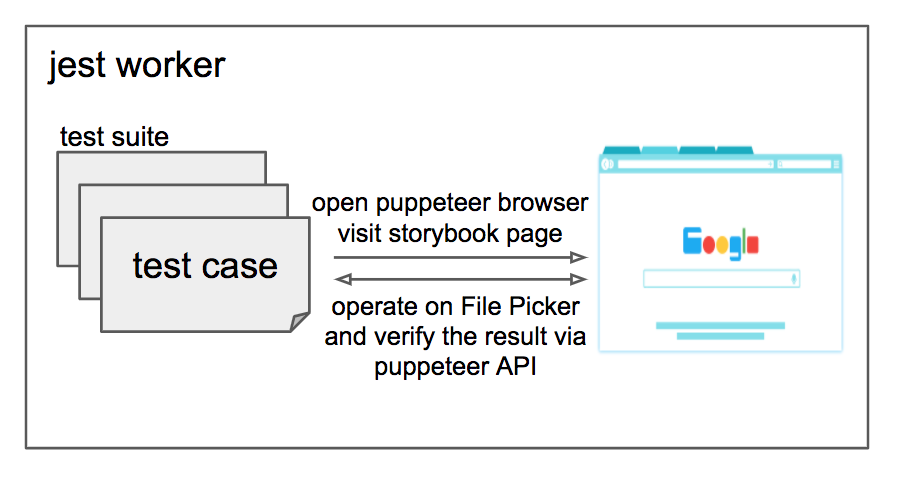

## Introduction

This project uses Storybook to test out the File Picker's various modes and
options. The Storybook stories help with both development as well as manual and
automated testing.

We use the File Picker React wrapper accessible at
`window.Kloudless.filePickerReact` to write stories. To use the Vue wrapper
instead, use  `window.Kloudless.filePickerVue`. In addition,
`window.Kloudless.filePicker` can be used to access the regular JavaScript File
Picker interface.

Here is the structure of this project:

```sh
.
├── README.md
├── babel.config.js           # babel configuration
├── config.js                 # env vars and constants
├── jest-puppeteer.config.js  # puppeteer configuration
├── jest.config.js            # jest configuration
├── package.json
├── static/                   # assets hosted by storybook
├── stories/                  # put stories
│   └── core/                 # helper methods to write stories
└── tests/
    ├── image/                # put image snapshot tests
    │   ├── __image_snapshots__/  # image snapshots
    │   │   └── __diff_output__/  # image snapshot diffs
    │   └── core/             # helper methods to write tests and faked responses
    ├── integration/          # put integration tests
    │   └── core/             # helper methods to write tests
    └── setupTests.js         # jest global setup
```

### Workflow



### Integration Tests

Through Puppeteer API, open a browser, launch File Picker and operate it.
Then verify the result.

### Image Snapshot Tests

Similar to integration tests, but perform image comparison to see whether
UI gets changed or there is any visual regression.
Very useful for responsiveness testing on different devices.

For the first time, jest will produce the base images in
**__image_snapshots__/** folder.

The following tests will check whether the current image is the same as the
base image. If not, jest will produce an image diff in
**__image_snapshots__/__diff_output__/** folder.

If the changes are expected, then run again jest with `-u` option to update the
images.

```
npm run test -- -u
```

**Note**
Try not running image tests among multiple OS as the images may be different in
different OS even though the codes are the same.

## Install

Clone this repository, and then run:

```
npm ci --prefix=storybook-test/
```

## How to Run Storybook

In the project root, run the following commands in separate terminal windows:

- Startup a webpack dev server to host File Picker's "loader" and "picker"
  resources in watch mode.
  ```
  npm run dev:story
  ```
  This will output 3 loader bundles - `kloudless.picker.js`, 
  `kloudless.picker.react.js`, and `kloudless.picker.vue.js` for different
  frameworks. They are hosted are `http://localhost:8081/sdk/`.
  While the picker resources are hosted at `http://localhost:8082/file-picker/v2/`.

- Start the Storybook server.
  ```
  npm run storybook:test
  ```
  Then you can visit `http://localhost:9001` to browse stories.

  Both webpack dev server and storybook server watch for any changes to stories
  and File Picker's source code and reload the code when update.

## How to Write Stories

A Storybook is a collection of stories. Each story represents a single visual
state of a component. Therefore, each story will be a different option set of
the File Picker.

Please refer to Storybook Documentation about [writing stories](https://storybook.js.org/docs/react/writing-stories/introduction).

For the convenience of both manual testing and automated testing. It's good to
make options editable in each story. `createStory` and `createDropzoneStory` are
helper methods for that (currently only supporting React binding).

Please check [stories/basic.stories.js](./stories/basic.stories.js) for an
example.

## How to Run Tests

First, ensure the webpack dev server and storybook server is running.
See [How to Run Storybook](#How to Run Storybook).

Then, run the following command:

```sh
KLOUDLESS_APP_ID=<your App ID> KLOUDLESS_ACCOUNT_TOKEN=<token> npm run test --prefix=storybook-test

# Use `-u` to confirm the snapshots changes:
# npm run test --prefix=storybook-test -- -u

# Enable watch mode:
# npm run test --prefix=storybook-test -- --watch
```

## How to Write Tests

We use [puppeteer](https://pptr.dev/) to do automated testing on stories.
Includes snapshot testing and integration testing, located at `tests/image` and
`tests/integration` respectively.

We use snapshot testing to test responsiveness.

`PuppeteerHelper` is a helper that wraps up common operations on File Picker.
Use it to write tests.

Please check [tests/integration/index.test.js](./tests/integration/index.test.js)
and [tests/image/desktop.test.js](./tests/image/desktop.test.js) for examples.

## Environment Variables

Here are the environment variables you can use in testing or storybook.

| name | storybook | testing | description |
|-|-|-|-|
| BASE_URL | optional | optional | Defaults to https://api.kloudless.com. |
| PICKER_URL | optional | optional | Where loader loads the File Picker iframe. <br>Defaults to http://localhost:8082/file-picker/v2/index.html. |
| KLOUDLESS_APP_ID | optional | **required** | The launched App ID. |
| KLOUDLESS_ACCOUNT_TOKEN | optional | **required** | The launched token. |
| LOADER_URL | optional | x | Where to load loader scripts. <br>Defaults to http://localhost:8081/sdk. |
| DEBUG | x | optional | Set to a truthy value to turn off puppeteer headless mode. |
| CI | x | optional | If it's a truthy value. Jest will run the storybook and dev server before tests. Useful when running in CI server. |

## References

- [jest-image-snapshot](https://github.com/americanexpress/jest-image-snapshot)
- [jest](https://jestjs.io/en/versions)
- [storybook](https://storybook.js.org/docs/react/get-started/introduction)
- [puppeteer](https://pptr.dev/)